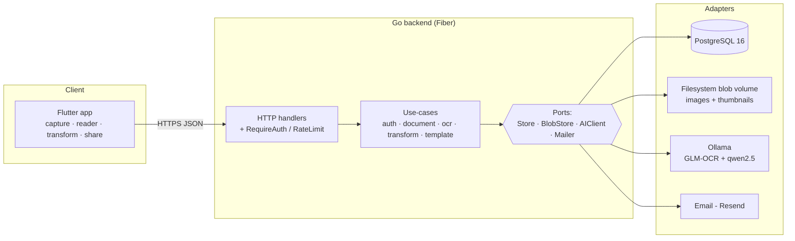
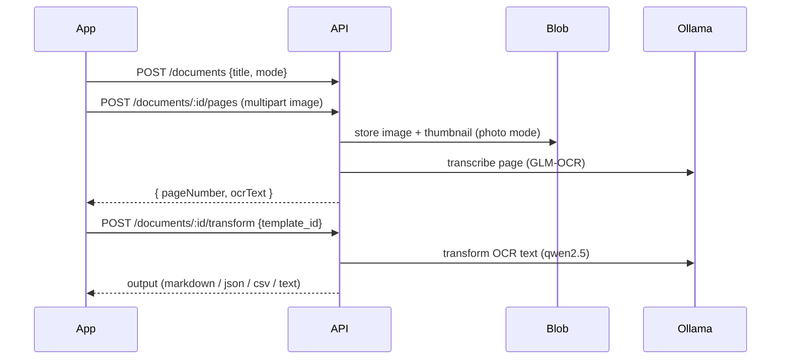

# Pustaka

Pustaka is a self-hosted, multi-user platform for **digitizing physical documents and books**.
A mobile app captures pages, the backend stores and normalizes the images, runs **per-page OCR**,
and applies **template-driven transforms** to turn raw scans into clean Markdown / JSON / CSV / text.
All AI inference runs **locally via [Ollama](https://ollama.com)** — documents never leave your
infrastructure.

- **Open self-signup** with email verification.
- **Capture → OCR → Transform** pipeline (GLM-OCR for transcription, qwen2.5 for transforms).
- **Read-only document sharing** between verified users.
- **Security first:** short-lived JWT access tokens + rotating refresh tokens, bcrypt, and a single
  centralized authorization rule (read = owner *or* active share; write = owner only).

---

## Table of contents

- [Architecture](#architecture)
- [Tech stack](#tech-stack)
- [Repository layout](#repository-layout)
- [Running locally](#running-locally)
- [How it flows](#how-it-flows)
- [API overview](#api-overview)
- [Testing](#testing)
- [Security model](#security-model)

---

## Architecture

Hexagonal-lite **ports & adapters**. The domain and use-case layers never import adapters; adapters
depend inward only. The Flutter app is the sole client of the JSON API.



The backend has no GPU requirement of its own: it talks to an Ollama server over HTTP, which can run
on a separate GPU host.

---

## Tech stack

**Backend** — Go 1.26 · [Fiber](https://gofiber.io) v2 · [pgx](https://github.com/jackc/pgx) v5 +
[sqlc](https://sqlc.dev) · golang-migrate (embedded migrations) · golang-jwt v5 · bcrypt · slog ·
`disintegration/imaging` (pure-Go image resize) · testcontainers-go + testify.

**Mobile** — Flutter 3.27 / Dart 3.6 (Material 3) · flutter_riverpod · dio · go_router ·
flutter_secure_storage · image_picker + flutter_image_compress · package_info_plus + url_launcher ·
mocktail (tests).

**Infra** — PostgreSQL 16 · Ollama (`glm-ocr`, `qwen2.5:14b-instruct`) · Docker Compose (local DB).

---

## Repository layout

```
pustaka/
├── backend/
│   ├── cmd/{server,seed}/              composition root + idempotent admin seed
│   ├── internal/
│   │   ├── config/                     env-driven config
│   │   ├── domain/                     entities, ports, sentinel errors (stdlib only)
│   │   ├── app/{auth,document,ocr,transform,template}/   use-cases
│   │   ├── adapter/
│   │   │   ├── store/                  pgx + sqlc; embedded db/migrations
│   │   │   ├── blob/                   filesystem image/thumbnail store (+ in-memory mock)
│   │   │   ├── ai/                     Ollama client (+ mock)
│   │   │   ├── mail/                   email sender (+ mock)
│   │   │   └── httpapi/{,middleware}/  Fiber handlers, auth/rate-limit middleware
│   │   └── pkg/{hash,jwt}/             crypto helpers
│   ├── db/queries/                     sqlc source
│   └── test/integration/              build-tagged end-to-end suite (real server over HTTP)
└── mobile/
    └── lib/
        ├── core/{api,auth,capture,update,router,theme,di}/   cross-cutting
        ├── features/{auth,library,capture,reader,templates,transform,sharing}/
        └── shared/widgets/
```

---

## Running locally

### Prerequisites

- **Go 1.26** and **Docker** (for the local Postgres).
- **Flutter 3.27+** (for the mobile app).
- An **Ollama** server reachable over HTTP with the models pulled:
  ```bash
  ollama pull glm-ocr
  ollama pull qwen2.5:14b-instruct
  ```
  Ollama may run on the same machine or a separate GPU host.

### Backend

```bash
cd backend
cp .env.example .env
#  edit .env: set JWT_SECRET, and point OLLAMA_HOST at your Ollama server.
#  (RESEND_API_KEY / MAIL_FROM are only needed to send real verification emails.)

make db-up     # Postgres in Docker, bound to 127.0.0.1:5434
make run       # API on 127.0.0.1:8002 (auto-runs migrations unless APP_ENV=prod)
make seed      # upsert a pre-verified admin (default: admin / admin123)
```

Health check: `curl http://127.0.0.1:8002/api/health`.

> Email verification codes are sent via the mailer. For local development without an email provider,
> use `make seed` to create a verified admin and log in with it, rather than completing the
> register → verify flow.

### Mobile

```bash
cd mobile
flutter pub get

# Run against your local backend (Android emulator reaches the host at 10.0.2.2):
flutter run --dart-define=USE_LOCAL=true

# Build a debug APK:
flutter build apk --debug
```

Without `--dart-define=USE_LOCAL=true`, the app targets its configured remote API base URL.

---

## How it flows

### Sign up & authentication

```mermaid
sequenceDiagram
  participant App
  participant API
  participant Mail
  App->>API: POST /auth/register {username,email,password}
  API->>Mail: send 6-digit code
  App->>API: POST /auth/verify-email {email,code}
  API-->>App: { accessToken, refreshToken }
  Note over App,API: access token (15m) on every request;<br/>on 401 the app silently rotates the refresh token
```

### Capture → OCR → Transform



- **Photo mode** stores the normalized image (longest edge ≤ 2048px, JPEG q80) plus a thumbnail.
- **Text mode** uses the image transiently for OCR only and never persists it.
- Transforms are **page-scoped** (per page → JSON array) or **document-scoped** (whole doc → single artifact).

### Sharing & authorization

Every document/page/output read is checked by one rule: **owner OR an active share** can read;
**only the owner** can write (capture, transform, share). A non-owner with no share gets `404` (the
document's existence is never revealed); a sharee attempting a write gets `403`. Revoking a share cuts
access on the next request.

---

## API overview

All endpoints live under `/api` and return a uniform envelope: `{ "status": 0|1, "message": "", "data": ... }`
(`status: 0` = success).

| Area | Endpoints |
|---|---|
| Auth | `POST /auth/{register,verify-email,resend-verification,login,refresh,logout}` · `GET /auth/me` |
| Documents | `GET/POST /documents` · `GET /documents/:id` |
| Pages | `POST /documents/:id/pages` · `GET /documents/:id/pages/:n/{image,thumb}` · `POST /documents/:id/pages/:n/ocr` |
| Transform | `POST /documents/:id/transform` · `GET /outputs/:id` |
| Templates | `GET /templates` |
| Sharing | `POST/GET /documents/:id/shares` · `DELETE /documents/:id/shares/:userId` |
| Mobile OTA | `GET /version` (open) · `GET /version/download` · `PUT /version` (admin) |

---

## Testing

**Backend** — Postgres via testcontainers; the AI client and blob store are mocked (no GPU, no real
filesystem, no real Ollama in tests).

```bash
cd backend
make test        # unit + handler + in-process end-to-end
make int-test    # boots the real server binary over HTTP (mocked Ollama)
go vet ./...
```

CI (`backend/.github/workflows/ci.yml`) runs the unit suite and the integration suite as separate jobs.

**Mobile** — unit + widget tests with mocked HTTP (no network, no platform channels).

```bash
cd mobile
flutter analyze
flutter test
```

---

## Security model

- **Tokens:** 15-minute HS256 access JWT + opaque, rotating, SHA-256-hashed refresh tokens. Reusing a
  revoked refresh token revokes the whole session (theft response).
- **Email verification:** 6-digit, bcrypt-hashed, single-use codes with expiry and an attempt cap.
- **Enumeration-resistant:** register / login / resend return generic responses; sharing with an
  unknown or unverified address returns a generic error.
- **Rate limiting:** in-memory per-IP + path limit on auth endpoints.
- **Authorization:** decided in exactly one place — read = owner or active share, write = owner only.
- **Local AI:** OCR and transforms run on your own Ollama server; document contents are not sent to any
  third-party API.
